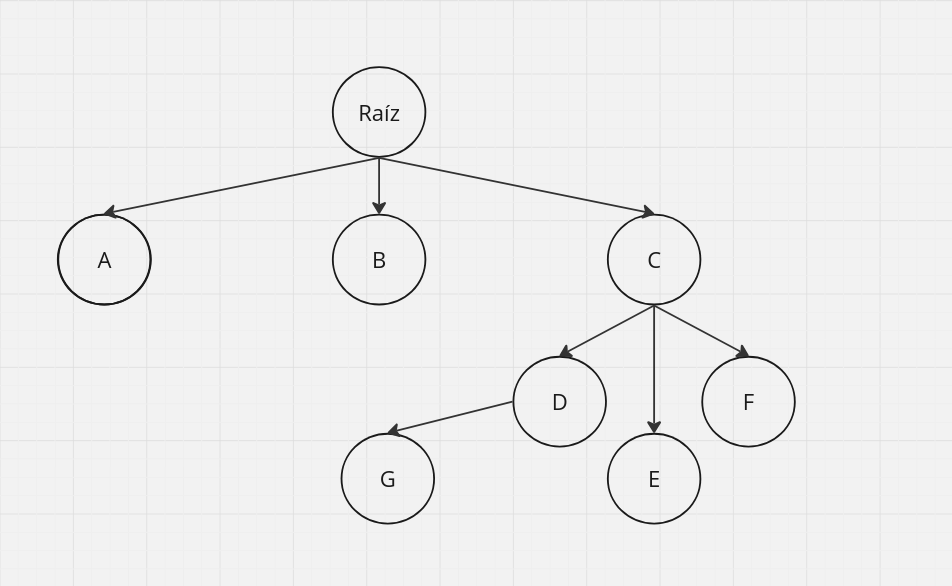
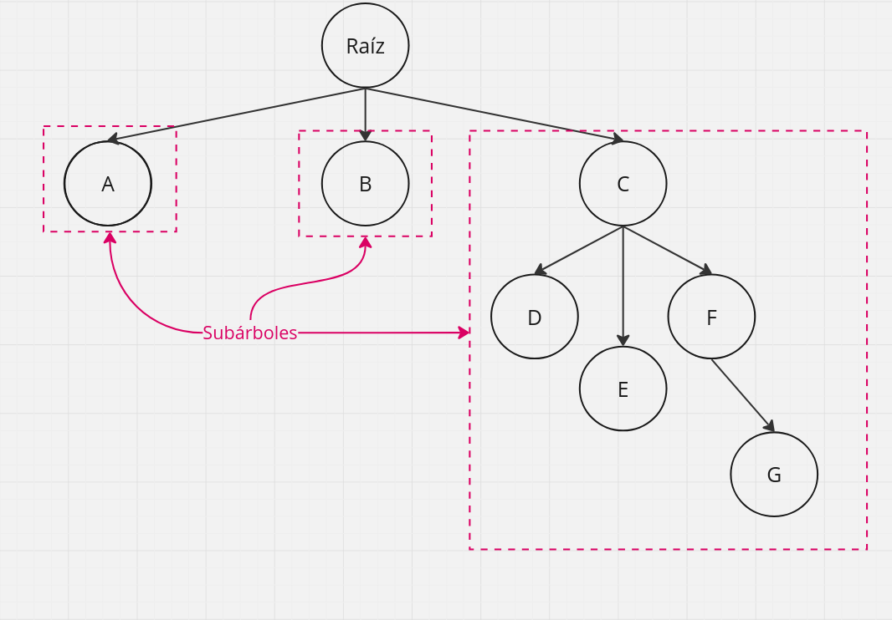
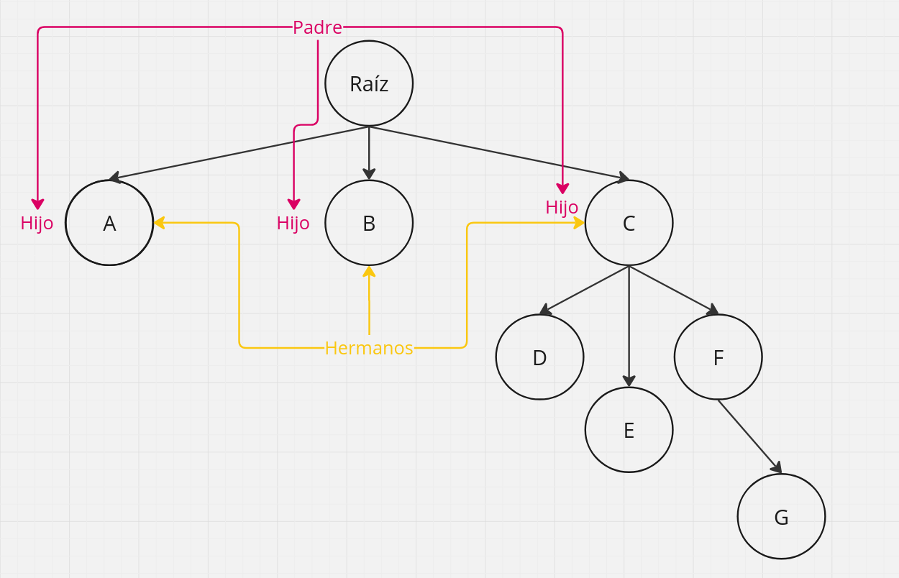
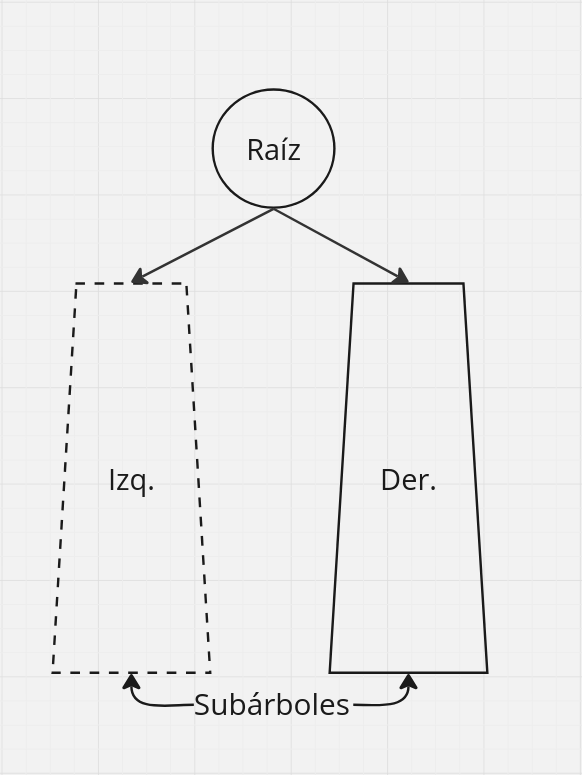
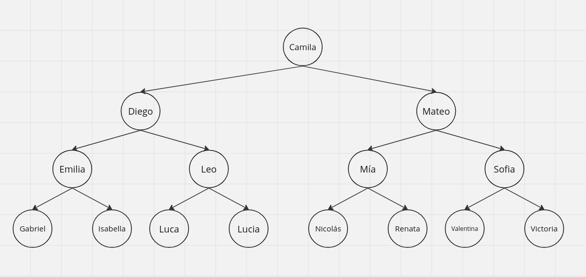
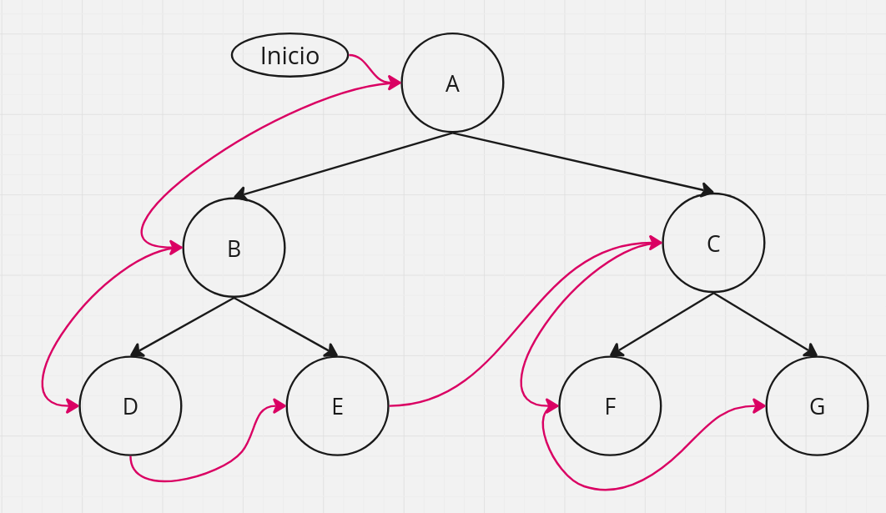
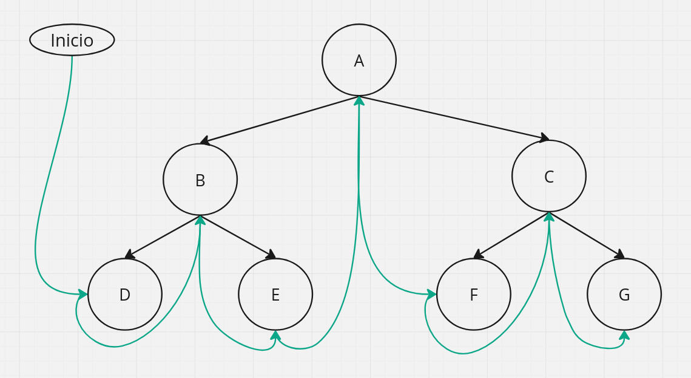
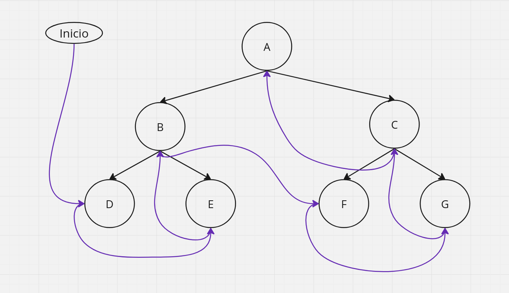
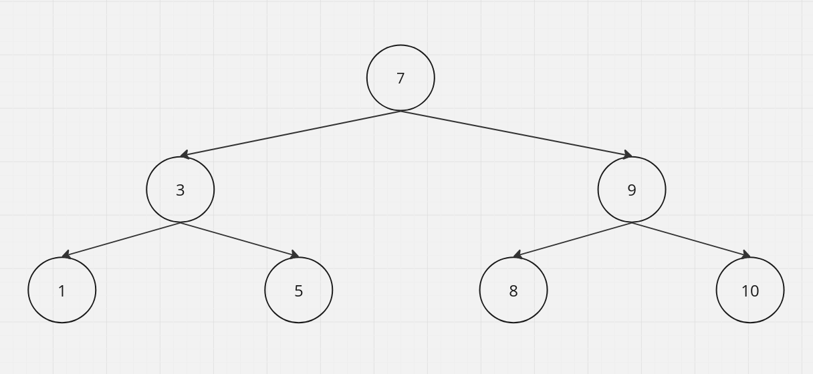
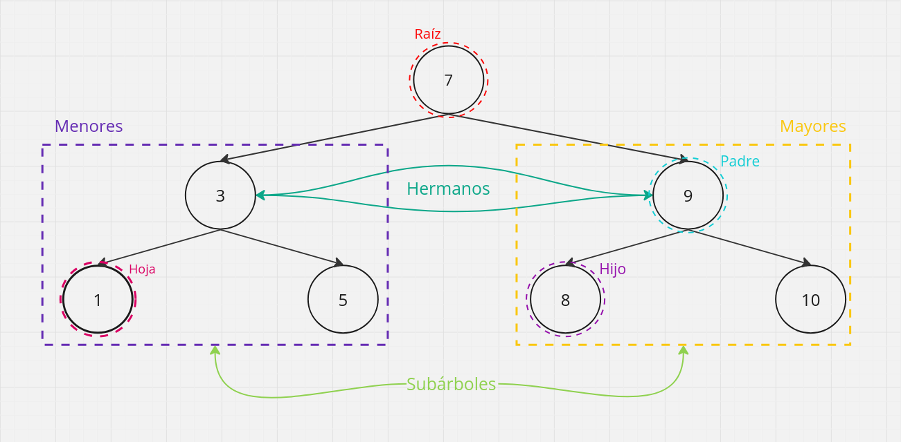

<div align="right">

</div>

# TDA ABB

## Alumno: Rivas Sofia Belen - 112216 - srivas@fi.uba.ar

- Para compilar:

```bash
gcc -std=c99 -Wall -Wconversion -Wtype-limits -pedantic -Werror -O2 tp_hash.c $(find src -name '*.c') -I./src -o tp_hash
```

- Para ejecutar con archivo por terminal:

```bash
./tp_abb archivo.csv
```

- Para ejecutar eligiendo dentro el archivo:

```bash
./tp_abb
```

- Para ejecutar con valgrind:
```bash
valgrind --leak-check=full --track-origins=yes --show-reachable=yes --error-exitcode=2 --show-leak-kinds=all --trace-children=yes ./tp_abb archivo.csv
```

---

##  Funcionamiento

#### Requisitos para una buena visualización de la interfaz
- La terminal debe estar en **pantalla completa** para evitar desfases en la visualización del contenido impreso.

- Preferentemente debe ejecutarse un ```clear``` antes de ejecutar el programa para evitar comportamientos anormales en las impresiones.

---

La presente entrega tiene como objetivo la implementación del TDA Árbol Binario de Búsqueda para crear una pokedex en la que el usuario pueda consultar el total de sus pokemones o buscar uno en específico, obteniendo la información de un archivo en formato 'csv' (si este no se ha pasado como parámetro, el usuario tendra dentro del programa la opción de ingresar su nombre y su separador en caso de ser necesario).

Antes de comenzar a desarrollar conceptos/funciones/etc de la implementación realizada, considero necesario establecer las definiciones de **Árbol, Árbol binario y Árbol binario de búsqueda** para distinguir sus características específicas y establecer su propósito y eficiencia dependiendo la operación requerida.

## Árbol
Se define como una colección de **nodos** (elementos del árbol) utilizada como reemplazo de las *listas enlazadas* a la hora de trabajar con grandes cantidades de datos debido a que reduce el tiempo de acceso a estos (**O(*log n*)** en promedio). Este tipo de árbol (genérico) se usa cuando la cantidad de hijos por nodo es impredecible o puede variar mucho (como en un sistema de archivos).

<div align="center">


</div>

La colección consiste en un **nodo raíz** (r), y cero o muchos sub-árboles no vacíos; cada uno posee su raíz conectada mediante un vértice al nodo raíz (r) a la cual llamamos **nodo hijo** del *nodo raíz (r)*, siendo también de esta manera r el **nodo padre** de cada sub-árbol de r. A su vez, llamamos **nodos hermanos** a aquellos que tienen el mismo padre.

<div align="center">

</div>

### Operaciones básicas de un árbol general
Sin asumir un balanceo o equilibrio/orden dentro del árbol y estudiandolo de forma completamente generalizada (incluso diría asumiendo "el peor de los casos"), nos encontramos con complejidades similares a las de la lista enlazada.

- **Crear**: Se reserva memoria para un árbol/nodo raíz y se inicializan los punteros a NULL (especialmente el nodo raíz).
- **Destruir**: Se recorre (preferentemente de forma recursiva) el árbol para liberar cada nodo.
- **Vacío**: Se verifica si la raíz del árbol es NULL.
- **Insertar**: Añade un hijo a un nodo existente. Si el árbol está vacío, el nuevo nodo se convierte en la raíz.
- **Eliminar**: La eliminación implica encontrar el nodo a eliminar y ajustar sus hijos. Se debe manejar la memoria adecuadamente para evitar leaks.
- **Buscar**: La búsqueda se puede realizar a través de un recorrido del árbol al comparar valores.
- **Recorrer**: Visita y procesa todos los nodos en un orden específico.

<div align="center">
    <table border="1">
        <thead>
            <tr>
                <th>Operación</th>
                <th>Complejidad (O)</th>
            </tr>
        </thead>
        <tbody>
            <tr>
                <td>Crear</td>
                <td>O(1)</td>
            </tr>
            <tr>
                <td>Destruir</td>
                <td>O(n)</td>
            </tr>
            <tr>
                <td>Vacío</td>
                <td>O(1)</td>
            </tr>
            <tr>
                <td>Insertar</td>
                <td>O(1) (si se conoce el padre) / O(n) (si se busca el padre)</td>
            </tr>
            <tr>
                <td>Eliminar</td>
                <td>O(n)</td>
            </tr>
            <tr>
                <td>Buscar</td>
                <td>O(n)</td>
            </tr>
            <tr>
                <td>Recorrer</td>
                <td>O(n)</td>
            </tr>
        </tbody>
    </table>
</div>

## Árbol binario
Estos árboles comparten la definición que dimos de *Árbol* y además nos permiten tener la noción de *derecha* e *izquierda*, es por esto mismo que suelen estar relacionados con *operaciones de búsqueda* ya que nos permite "ver donde seguir buscando", si a la derecha o a la izquierda de un valor.
Puede estar vacío, o consistir en un **nodo raíz** junto a **dos árboles binarios**
<div align="center">


</div>

### Recorrido
Un árbol binario puede recorrerse de las siguientes tres formas:
- **Preorden**: Se visita el nodo actual y luego se recorren los sub-árboles de izquierda a derecha.
<div align="center">

</div>

- **Inorden**: Se visita el sub-árbol izquierdo, luego el nodo actual y por último el sub-árbol derecho.
<div align="center">

</div>

- **Postorden**: Se visita el sub-árbol izquierdo, luego el sub-árbol derecho y por último el nodo actual.
<div align="center">

</div>

### Operaciones básicas de un árbol binario

- **Crear**: Asigna memoria y establece los punteros izquierdo y derecho como NULL.
- **Destruir**: Se recorre (preferentemente de forma recursiva) el árbol para liberar cada nodo.
- **Vacío**: Se verifica si la raíz del árbol es NULL.
- **Insertar**: Añade un hijo a un nodo existente. Si el árbol está vacío, el nuevo nodo se convierte en la raíz.
- **Eliminar**: La eliminación implica encontrar el nodo a eliminar y ajustar sus hijos. Se debe manejar la memoria adecuadamente para evitar leaks.
- **Buscar**: La búsqueda se puede realizar a través de un recorrido del árbol al comparar valores.
- **Recorrer**: Visita y procesa todos los nodos en un orden específico.

<div align="center">
    <table border="1">
        <thead>
            <tr>
                <th>Operación</th>
                <th>Complejidad (O)</th>
            </tr>
        </thead>
        <tbody>
            <tr>
                <td>Crear</td>
                <td>O(1)</td>
            </tr>
            <tr>
                <td>Destruir</td>
                <td>O(n)</td>
            </tr>
            <tr>
                <td>Vacío</td>
                <td>O(1)</td>
            </tr>
            <tr>
                <td>Insertar</td>
                <td>O(log n) en árbol balanceado / O(n) en árbol desbalanceado</td>
            </tr>
            <tr>
                <td>Eliminar</td>
                <td>O(log n) en árbol balanceado / O(n) en árbol desbalanceado</td>
            </tr>
            <tr>
                <td>Buscar</td>
                <td>O(log n) en árbol balanceado / O(n) en árbol desbalanceado</td>
            </tr>
            <tr>
                <td>Recorrer</td>
                <td>O(n)</td>
            </tr>
        </tbody>
    </table>
</div>

*Aclaración:*
*Llamamos **balanceado** a un árbol binario en el que la diferencia de altura entre los sub-árboles de cualquier nodo es como máximo 1, lo que garantiza operaciones eficientes con complejidad O(log n).*
*Por otro lado, llamamos **desbalanceado** a un árbol donde uno de los sub-árboles es mucho más profundo que el otro, lo que puede llevar a una complejidad O(n) en el peor caso.*

## Árbol binario de búsqueda
Este árbol posee las características previamente estipuladas para el *árbol binario* y además nos permite una mejor velocidad de búsqueda debido al aprovechamiento de su estructura organizada. Se trata de un *árbol binario* que puede estar vacío o contener un **valor clave** en cada nodo que cumpla lo siguiente:
- La clave del hijo izquierdo es menor que la clave del nodo padre.
- La clave del hijo derecho es mayor que la clave del nodo padre.
- Los subárboles derecho e izquierdo son, a su vez, árboles binarios de búsqueda (ABB).
<div align="center">


</div>

### Operaciones básicas de un árbol binario de búsqueda

- **Crear**: Recibe un puntero a una función de comparación que determina el orden de los elementos y devuelve un puntero al ABB creado o NULL si ocurre un error.
- **Destruir**: Se recorre (preferentemente de forma recursiva) el árbol para liberar cada nodo.
- **Vacío**: Se verifica si la raíz del árbol es NULL.
- **Insertar**: Añade un hijo a un nodo existente. Si el árbol está vacío, el nuevo nodo se convierte en la raíz.
- **Eliminar**: La eliminación implica encontrar el nodo a eliminar y ajustar sus hijos dependiendo el tipo de nodo y cantidad de hijos. Se debe manejar la memoria adecuadamente para evitar leaks.
- **Buscar**: La búsqueda se puede realizar a través de un recorrido del árbol al comparar valores. La clave buscada se compra con la clave del nodo raíz, si son iguales se detiene, si la clave buscada es mayor se reanuda la búsqueda en el sub-árbol derecho, caso contrario se reanuda en el sub-árbol izquierdo.
- **Recorrer**: Visita y procesa todos los nodos en un orden específico. (Los recorridos son los mencionados anteriormente para el árbol binario)

<div align="center">
    <table border="1">
        <thead>
            <tr>
                <th>Operación</th>
                <th>Complejidad (Promedio)</th>
                <th>Complejidad (Peor Caso)</th>
            </tr>
        </thead>
        <tbody>
            <tr>
                <td>Crear</td>
                <td>O(1)</td>
                <td>O(1)</td>
            </tr>
            <tr>
                <td>Destruir</td>
                <td>O(n)</td>
                <td>O(n)</td>
            </tr>
            <tr>
                <td>Vacío</td>
                <td>O(1)</td>
                <td>O(1)</td>
            </tr>
            <tr>
                <td>Insertar</td>
                <td>O(log n)</td>
                <td>O(n)</td>
            </tr>
            <tr>
                <td>Eliminar</td>
                <td>O(log n)</td>
                <td>O(n)</td>
            </tr>
            <tr>
                <td>Buscar</td>
                <td>O(log n)</td>
                <td>O(n)</td>
            </tr>
            <tr>
                <td>Recorrer</td>
                <td>O(n)</td>
                <td>O(n)</td>
            </tr>
        </tbody>
    </table>
</div>

**Considerando como peor caso un árbol desbalanceado**

## Implementación
Para implementar el ABB pedido, plantee un enfoque principalmente **recursivo** con el fin de *aprovechar la estructura jerárquica del árbol* y simplificar el código al trabajar con sub-árboles con cada llamada. Por ejemplo, al recorrer el árbol en *inorden, preorden o postorden*, la recursividad es natural dado que cada nodo tiene sub-árboles izquierdo y derecho que se procesan recursivamente.
Cada nodo del árbol se reserva mediante *malloc* y se libera con *free*. Las funciones *destruir_nodos_rec* y *destruir_nodos_elementos_rec* aseguran que la memoria de los nodos y, opcionalmente, de los elementos almacenados se liberen correctamente, evitando así leaks de memoria.

#### Manejo de nodos y punteros
- Cada nodo contiene punteros a sus subárboles izquierdo y derecho (nodo->izq y nodo->der).
- Caso especial en la eliminación de nodos:
    - Si el nodo a eliminar es una hoja, simplemente se libera y se desconecta del árbol.
    - Si tiene un solo hijo, el nodo se reemplaza por su hijo.
    - Si tiene dos hijos, se busca el mayor nodo del subárbol izquierdo como reemplazo, lo que requiere navegar recursivamente hasta el nodo adecuado.
#### Liberación de memoria
La función abb_destruir_todo permite liberar no solo los nodos, sino también los elementos almacenados, en caso de que estos requieran una liberación específica (por ejemplo, si son estructuras dinámicas). Esta flexibilidad se logra mediante el uso de un puntero a una función destructora.

## Implementación en TP ABB

#### Agregar pokemon al ABB

Para agregar un pokemon al ABB después de haber sido parseado, se utiliza el siguiente procedimiento:

- **Creación de un nuevo nodo:** Se utiliza memoria dinámica para crear un nuevo nodo, en el cual se asigna el struct pokemon al campo "elemento" del nodo.

- **Inserción en el ABB:** La inserción de un pokemon en el ABB se realiza comparando el nombre del pokemon con los nombres de los nodos existentes. Si el nombre del pokemon es menor, se inserta en el subárbol izquierdo; si es mayor, se inserta en el subárbol derecho. Este proceso continúa recursivamente hasta encontrar la ubicación adecuada para el nuevo nodo.

#### Búsqueda de pokemones

Para la búsqueda de un pokemon en el ABB, se implementa la función buscar_pokemon, la cual recibe el nombre del pokemon como parámetro. Esta función recorre el árbol, comparando el nombre de cada pokemon almacenado en los nodos hasta encontrar una coincidencia. En caso de éxito, devuelve un puntero al pokemon encontrado; de lo contrario, retorna NULL e informa de la situación.

#### Imprimir pokedex

Además de lo mencionado, se incluye la función imprimir_pokedex, que utiliza un recorrido inorden del ABB para iterar sobre todos los nodos e imprimir la información de cada pokemon. Esto facilita al usuario obtener una visión general de todos los pokemon que posee, en caso de que elija la opción correspondiente.

#### Destruir pokedex

Una vez finalizado todo el flujo principal del programa, se procede a destruir la pokedex para garantizar que no quede ningún leak de memoria. Se hace uso de la función `abb_destruir_todo`, que se encarga de aplicarle un destructor (en este caso libera los atributos del pokemon) a cada elemento del ABB y posteriormente destruye el mismo.

---