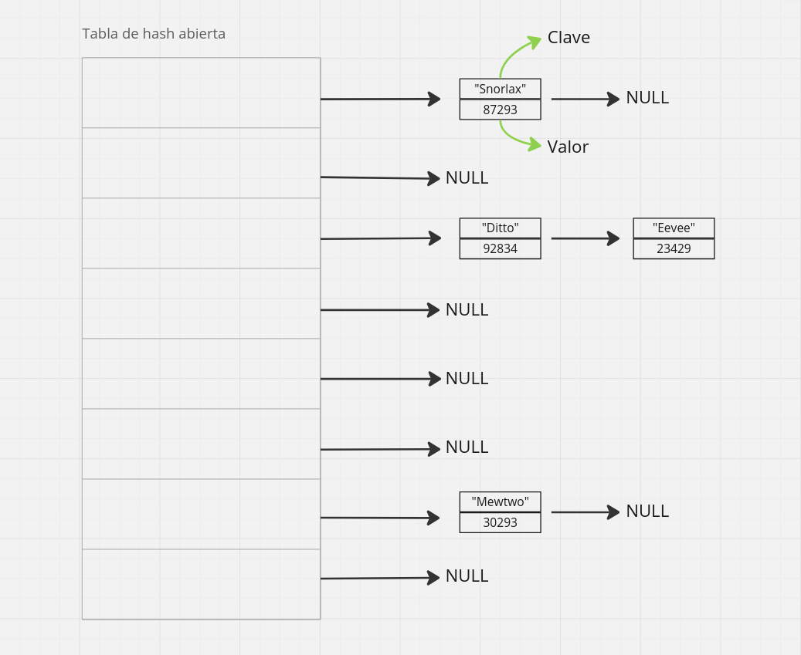
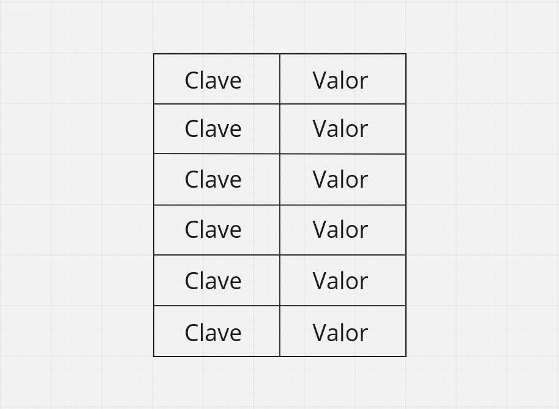
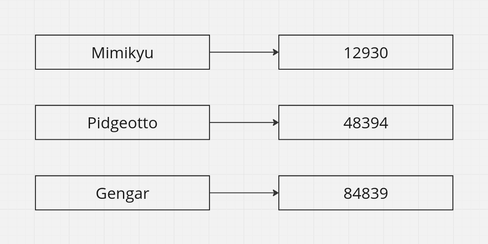

<div align="right">

</div>

# TDA HASH

## Repositorio de Rivas Sofia Belen - 112216 - srivas@fi.uba.ar

- Para compilar:

```bash
gcc -std=c99 -Wall -Wconversion -Wtype-limits -pedantic -Werror -O2 tp_hash.c $(find src -name '*.c') -I./src -o tp_hash
```

- Para ejecutar con archivo por terminal:

```bash
./tp_hash archivo.csv
```

- Para ejecutar eligiendo dentro el archivo:

```bash
./tp_hash
```

- Para ejecutar con valgrind:
```bash
valgrind --leak-check=full --track-origins=yes --show-reachable=yes --error-exitcode=2 --show-leak-kinds=all --trace-children=yes ./tp_hash archivo.csv
```
---
##  Funcionamiento

#### Requisitos para una buena visualización de la interfaz
- La terminal debe estar en **pantalla completa** para evitar desfases en la visualización del contenido impreso.

- Preferentemente debe ejecutarse un ```clear``` antes de ejecutar el programa para evitar comportamientos anormales en las impresiones.

---

La presente entrega tiene como objetivo la implementación del TDA Hash (explicado en un apartado posterior) para crear una pokedex en la que el usuario pueda consultar el total de sus pokemones o buscar uno en específico, obteniendo la información de un archivo en formato 'csv' (si este no se ha pasado como parámetro, el usuario tendra dentro del programa la opción de ingresar su nombre y su separador en caso de ser necesario). Se utiliza una tabla de Hash abierta con direccionamiento cerrado.

<div align="center">
    
</div>

Cabe aclarar que la función de Hash utilizada fue la función **djb2**, ya que se recomienda para trabajar con strings debido a su sencilla implementación y capacidad para generar valores de hash dispersos que minimizan las colisiones en muchas aplicaciones. Esta función toma un string (en este caso, el nombre del pokemon) como entrada y genera un valor numérico que sirve como índice en la tabla hash. El algoritmo djb2 realiza la siguiente operación sobre cada carácter del string:

```c
hash = ((hash << DESPLAZAMIENTO_HASH_DJB2) + hash) + c;
```

Donde `hash` es el valor calculado hasta el momento, `c` es el valor ASCII del carácter actual y el desplazamiento de 5 bits (representado por hash << DESPLAZAMIENTO_HASH_DJB2) es lo que permite dispersar los valores y evitar colisiones. Esto se repite para cada carácter en el string.

El valor final del hash se usa como índice para almacenar o recuperar información en la tabla hash.

---

## Sobre el TDA Hash
El TDA Hash es una estructura de datos fundamental para la implementación de **diccionarios**, conjuntos y tablas de búsqueda rápidas. El concepto de este TDA se refiere a la implementación de una estructura que asocia claves con valores a través de una función hash. El objetivo principal es proporcionar acceso rápido a los elementos mediante una clave única, lo que hace que las operaciones sean muy eficientes en materia de complejidad.

### Diccionarios
Un diccionario es una estructura de datos que almacena pares *clave-valor*, permitiendo la recuperación, inserción y eliminación eficiente de elementos en función de **claves únicas**. Son considerados útiles para casos donde se necesita acceder a datos, sin duplicación de entradas, por una clave específica con una velocidad alta.

<div align="center">
    
</div>

#### Algunas formas de implementarlos
#### Tabla de Hash (Hash Table)
Una tabla de hash es una estructura de datos que utiliza una función hash para mapear claves a posiciones específicas en un array. Cada elemento en el array es un "bucket" que contiene la clave y el valor asociados. Las tablas de hash son rápidas para operaciones de búsqueda, inserción y eliminación, con una complejidad promedio de O(1)

- **Ventajas**: Acceso rápido, eficiente para búsquedas.
- **Desventajas**: Pueden tener problemas de colisiones, que se resuelven con técnicas como encadenamiento o direccionamiento abierto.

#### Listas Ordenadas (o Listas Enlazadas)
Una lista ordenada es una estructura de datos en la que los elementos (pares clave-valor) se mantienen ordenados de acuerdo a las claves. Se puede implementar como un array o una lista enlazada. La búsqueda en una lista ordenada requiere un recorrido secuencial o búsqueda binaria, lo que da una complejidad de O(logn) para búsqueda binaria en arrays ordenados.

- **Ventajas**: Sencilla de implementar y fácil de mantener en orden.
- **Desventajas**: Búsqueda, inserción y eliminación son más lentas que en las tablas de hash (O(n) en el peor de los casos para listas enlazadas).

#### Árbol de Búsqueda Binaria (ABB)
Un árbol de búsqueda binaria (ABB) es una estructura en la que cada nodo tiene una clave y dos subárboles: izquierdo y derecho. Las claves en el subárbol izquierdo son menores que la clave del nodo, y las del subárbol derecho son mayores. Este tipo de implementación permite búsquedas, inserciones y eliminaciones con complejidad O(log n) en promedio.

- **Ventajas**: Ordenación implícita de las claves y eficiencia en la búsqueda.
- **Desventajas**: Si el árbol no es balanceado, la complejidad en el peor caso puede ser O(n). Usar un árbol balanceado (como un AVL o un rojo-negro) resuelve este problema.

### Función de hash
Una función de hash es un mecanismo que convierte una entrada (en este caso, un string) en un valor numérico que se utiliza como un índice para localizar esa entrada en una estructura de datos, como una tabla hash. Esencialmente, la función de hash ayuda a distribuir las claves de manera uniforme en la tabla para minimizar las colisiones, es decir, los casos en los que múltiples claves se asignan al mismo índice.

<div align="center">
    
</div>

#### Características que debe tener una función de hash para nuestro problema:
- **Uniformidad**: La función de hash debe distribuir las claves de forma uniforme a lo largo de la tabla de hash para evitar la acumulación de claves en una misma posición, lo que podría degradar el rendimiento de la búsqueda y la inserción.
- **Determinismo**: La función debe producir siempre el mismo resultado para un string dado. Esto garantiza que se pueda encontrar el mismo índice para una clave específica.
- **Rápida de calcular**: La función debe ser eficiente en términos de tiempo de ejecución para no ralentizar las operaciones de la tabla de hash.
- **Manejo de colisiones**: Si bien el problema menciona que la tabla usará direccionamiento cerrado (listas enlazadas para colisiones), la función debe minimizar las colisiones tanto como sea posible.
- **Dispersión de datos**: La función debe ser capaz de manejar strings de diferente longitud y contenido, proporcionando una buena distribución incluso para strings similares.

### Tabla de hash

Una **tabla de hash** es una estructura de datos que implementa un diccionario o un mapa, permitiendo almacenar pares de clave-valor de forma eficiente. El acceso a los elementos se realiza mediante una **función de hash**, que convierte una clave (en este caso, un string) en un índice de un array subyacente, donde se almacena el valor asociado.

#### Problema de colisiones
Las colisiones ocurren cuando dos claves diferentes se asignan al **mismo índice** en la tabla. Como resultado, es necesario implementar un mecanismo para resolverlas y garantizar que las operaciones de inserción y búsqueda funcionen correctamente.

#### Métodos de resolución de colisiones
- **Encadenamiento (direccionamiento cerrado)**: En este método, cada posición en la tabla de hash contiene un puntero a una lista enlazada de elementos. Si dos claves producen el mismo índice, se almacenan en la lista de esa posición.
    - **Ventajas**:
        - Maneja colisiones de forma eficaz.
        - La tabla puede crecer sin límites fijos (dependiendo de la memoria disponible).
    - **Desventajas**:
        - Puede requerir más memoria (por las listas enlazadas).
        - Puede degradar el rendimiento si muchas claves se asignan al mismo índice, ya que implica recorrer listas.
        
- **Probing lineal (direccionamiento abierto)**: Cuando se produce una colisión, se busca la siguiente posición libre en la tabla secuencialmente (de forma lineal). Si el índice calculado está ocupado, se avanza a la siguiente posición y se repite hasta encontrar un espacio libre.
    - **Ventajas**:
        - Uso eficiente de la memoria (sin listas adicionales).
        - Fácil de implementar.
    - **Desventajas**:
        - Puede provocar agrupamiento primario, donde grupos de claves ocupan posiciones contiguas, aumentando el tiempo de búsqueda.
        - La tabla necesita estar lo suficientemente vacía para que el método funcione bien.
        
- **Probing cuadrático**: Similar al probing lineal, pero el desplazamiento aumenta de forma cuadrática (por ejemplo, 1, 4, 9, 16, ...).
    - **Ventajas**:
        - Reduce el agrupamiento primario.
    - **Desventajas**:
        -Puede provocar agrupamiento secundario y complicaciones si la tabla no se maneja adecuadamente.
        - No garantiza encontrar espacio si la tabla está muy llena.
        
- **Hashing doble**: Usa dos funciones de hash. Si una colisión ocurre, la segunda función de hash determina el desplazamiento.
    - **Ventajas**:
        - Minimiza el agrupamiento primario y secundario.
        - Distribuye mejor las claves en la tabla.
    - **Desventajas**:
        - Más complejo de implementar.
        - La segunda función de hash debe elegirse cuidadosamente para evitar ciclos y garantizar que se encuentre un espacio libre.
#### Sobre el tamaño de la tabla

El tamaño de la tabla es importante tanto para tablas abiertas (con encadenamiento) como para tablas cerradas (con direccionamiento abierto) porque afecta directamente al rendimiento y eficiencia de las operaciones, como búsqueda, inserción y eliminación de elementos.

#### En las tablas abiertas (con encadenamiento):
Aunque el encadenamiento permite que múltiples elementos se almacenen en la misma posición de la tabla a través de listas enlazadas, el tamaño de la tabla sigue siendo crucial. Si la tabla es pequeña en relación con el número de elementos a almacenar, el número de colisiones aumenta. Esto resulta en listas enlazadas más largas en cada posición, lo que hace que el tiempo de búsqueda e inserción sea mayor. Una tabla más grande permite distribuir las claves de manera más uniforme, reduciendo las colisiones y mejorando la eficiencia de las operaciones.

#### En las tablas cerradas (direccionamiento abierto):
En este tipo de tablas, el tamaño es aún más crítico, ya que las colisiones no se resuelven mediante listas enlazadas, sino a través de técnicas como el probing lineal o hashing doble. Si la tabla es demasiado pequeña, el factor de carga (número de elementos dividido por el número de posiciones) se incrementa, lo que genera una mayor cantidad de colisiones y aumenta el tiempo de búsqueda. Un factor de carga demasiado alto puede hacer que las operaciones se vuelvan muy lentas. Por eso, para mantener un buen rendimiento, el tamaño de la tabla debe ser adecuado y el factor de carga debe mantenerse bajo (típicamente por debajo de 0.7-0.8).

### ¿Importa el tamaño de la tabla en tablas abiertas (encadenamiento)?
Aunque en tablas abiertas (con encadenamiento) se permite que múltiples elementos se asignen al mismo índice mediante listas enlazadas, el tamaño de la tabla **sí importa** por las siguientes razones:

1. **Rendimiento de búsqueda**:
- Cuanto más pequeña sea la tabla en comparación con el número de elementos, más elementos habrá en cada lista de encadenamiento. Esto incrementa el tiempo de búsqueda, ya que cada colisión requiere recorrer una lista enlazada más larga.
- Una tabla más grande permite que las listas sean más cortas en promedio, lo que mejora el tiempo de búsqueda promedio.

2. **Inserción y eliminación eficientes**:
- Si la tabla es muy pequeña y la carga es alta, el tiempo de inserción también se ve afectado, ya que insertar un nuevo elemento puede requerir recorrer listas largas.
- Las operaciones de eliminación pueden volverse más complejas cuando hay muchas colisiones en una misma posición.

3. **Espacio y memoria**:
- Aunque una tabla abierta permite listas enlazadas, estas listas requieren memoria adicional. Si la tabla es lo suficientemente grande, se pueden evitar listas largas y reducir la necesidad de manejar memoria dinámica, lo cual simplifica la implementación y mejora el rendimiento general.