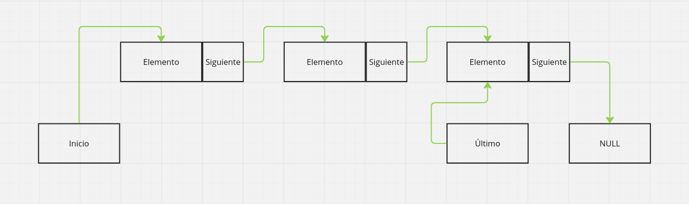

<div align="right">

</div>

# TDA LISTA

## Alumno: Rivas Sofia Belen - 112216 - srivas@fi.uba.ar

- Para compilar:

```bash
gcc -std=c99 -Wall -Wconversion -Wtype-limits -pedantic -Werror -O2 tp_lista.c -o tp_lista src/csv.c src/lista.c src/comm_user.c -I./src
```

- Para ejecutar con archivo por terminal:

```bash
./tp_lista archivo.csv
```

- Para ejecutar eligiendo dentro el archivo:

```bash
./tp_lista
```

- Para ejecutar con valgrind:
```bash
valgrind --leak-check=full --track-origins=yes --show-reachable=yes --error-exitcode=2 --show-leak-kinds=all --trace-children=yes ./tp_lista ejemplos/pokedex.csv
```

---

##  Funcionamiento

#### Requisitos para una buena visualización de la interfaz
- La terminal debe estar en **pantalla completa** para evitar desfases en la visualización del contenido impreso.

- Preferentemente debe ejecutarse un ```clear``` antes de ejecutar el programa para evitar comportamientos anormales en las impresiones.

---

La presente entrega tiene como objetivo la implementación del TDA Lista para crear una pokedex en la que el usuario pueda consultar el total de sus pokemones o buscar uno en específico, obteniendo la información de un archivo en formato 'csv' (si este no se ha pasado como parámetro, el usuario tendra dentro del programa la opción de ingresar su nombre y su separador en caso de ser necesario).

Dado que trabajaremos con una lista simplemente enlazada, cada nodo de la lista contendrá un puntero al elemento (en este caso, un struct de tipo pokemon) y un puntero al siguiente nodo en la lista. Esta estructura permite almacenar y enlazar dinámicamente los pokemones.

```c
struct nodo {
	void *elemento;
	struct nodo *siguiente;
};
```

<div align="center">

</div>

Además, para un acceso más prolijo y ordenado, se ha definido dentro del struct lista un puntero al primer nodo y un puntero al último; de esta manera, los accesos relacionados a borrar o insertar elementos al inicio o al final adquieren complejidad O(1)

```c
struct lista {
	struct nodo *primero;
	struct nodo *ultimo;
	size_t cantidad;
};
```

Esto, implementado en `tp_lista.c`, nos deja con una pokedex (TDA lista) cuyo elemento de cada nodo contendrá un struct de tipo pokemon que almacenará los datos que se parsearon del archivo csv utilizando principalmente la función `leer_linea_csv` que ha sido definida de la siguiente manera:

<div align="center">

</div>

#### Agregar pokemon a la lista

Para agregar un pokemon a la lista después de haber sido parseado, se utiliza el siguiente procedimiento:

- **Creación de un nuevo nodo:** Se utiliza memoria dinámica para crear un nuevo nodo, en el cual se asigna el struct pokemon al campo "elemento" del nodo.

```c
struct nodo *nodo_nuevo = malloc(sizeof(struct nodo));

nodo_nuevo->elemento = pokemon_parseado;
nodo_nuevo->siguiente = NULL;

if (!nodo_nuevo)
		return false;
```

- **Inserción en la lista:** Dado que en este caso los pokemon se insertan al final de la lista, se redefine el campo "siguiente" del último nodo para que apunte al nuevo nodo. Además, se actualiza el campo "último" de la lista para que apunte al nodo recién agregado.

```c
//Previamente se usan if statements que contemplan otros casos...

if (posicion == lista->cantidad) {
		lista->ultimo->siguiente = nodo_nuevo;
		lista->ultimo = nodo_nuevo;
}
```

<div align="center">

</div>

#### Búsqueda de pokemones

Para la búsqueda de un pokemon en la lista, se implementa la función `buscar_pokemon`, la cual recibe el nombre del pokemon como parámetro. Esta función recorre la lista enlazada y compara el nombre de cada pokemon almacenado en los nodos hasta encontrar una coincidencia. En caso de éxito, devuelve un puntero al pokemon encontrado; de lo contrario, retorna NULL e informa de la situación.

#### Imprimir pokedex

Además de lo mencionado, se incluye la función `imprimir_pokedex`, que itera sobre todos los nodos de la lista e imprime la información de cada pokemon, facilitando al usuario una visión general de todos los pokemones que posee en caso de que elija la opción que lleva a esto.

#### Destruir pokedex

Una vez finalizado todo el flujo principal del programa, se procede a destruir la pokedex para garantizar que no quede ningún leak de memoria. Se hace uso de la función `lista_destruir_todo`, que se encarga de aplicarle un destructor (en este caso libera los atributos del pokemon) a cada elemento de la lista y posteriormente destruye la misma.

---

## Respuestas a las preguntas teóricas
### TDA Lista

Una lista es un TDA (Tipo de Dato Abstracto) que representa una colección de elementos organizados de manera secuencial. Las listas permiten el almacenamiento dinámico de elementos y pueden crecer o disminuir en tamaño a medida que se insertan o eliminan elementos.

**Operaciones Básicas:**

- Insertar: Agrega un elemento en cualquier posición de la lista.

- Obtener: Devuelve el elemento en una posición específica.

- Eliminar: Quita un elemento de la lista.

- Está vacía: Verifica si la lista no tiene elementos.

### Lista simplemente enlazada

Una lista simplemente enlazada es una variante de la lista que consiste en una secuencia de nodos, donde cada nodo contiene un valor y un puntero al siguiente nodo en la lista. Esto permite un acceso secuencial a los elementos.

**Operaciones Básicas:**

- Insertar: Agrega un elemento en cualquier posición de la lista. La complejidad puede ser O(1) si se inserta al inicio o al final en la implementación actual, pero es O(n) si se inserta en el medio.

- Obtener: Devuelve el elemento en una posición específica. La complejidad es O(n) ya que puede requerir recorrer la lista.

- Eliminar: Quita un elemento de la lista. Si se elimina el primer nodo, la operación es O(1), pero si se elimina un nodo en el medio o al final, la complejidad es O(n).

- Está vacía: Verifica si la lista no tiene elementos.

<div align="center">

</div>

### Lista doblemente enlazada

Una lista doblemente enlazada es una variante de la lista en la que cada nodo contiene un valor, un puntero al siguiente nodo y otro puntero al nodo anterior. Esto permite un acceso bidireccional a los elementos.

**Operaciones Básicas:**

- Insertar: Agrega un elemento en cualquier posición de la lista. La complejidad es O(1) si se inserta al inicio o al final (suponiendo que se tiene un puntero a esos nodos), pero es O(n) si se inserta en el medio, ya que se necesita recorrer la lista para encontrar la posición.

- Obtener: Devuelve el elemento en una posición específica. La complejidad es O(n) porque se puede requerir recorrer la lista desde el principio o desde el final hasta encontrar el nodo deseado.

- Eliminar: Quita un elemento de la lista. La complejidad es O(1) si se elimina el primer o el último nodo, ya que se puede acceder directamente a esos nodos. Sin embargo, si se elimina un nodo en el medio, la complejidad es O(n) porque se debe recorrer la lista para encontrar el nodo.

- Está vacía: Verifica si la lista no tiene elementos. Esta operación es de O(1).

<div align="center">

</div>

### TDA Pila

Una pila es un TDA (Tipo de Dato Abstracto) que sigue el principio de último en entrar, primero en salir (LIFO: Last In, First Out). Esto significa que el último elemento que se agrega a la pila es el primero que se quita.

**Operaciones Básicas:**

- Apilar (Push): Agrega un elemento en la parte superior de la pila.

- Desapilar (Pop): Elimina y devuelve el elemento que está en la parte superior de la pila.

- Tope: Permite acceder al elemento en la parte superior sin quitarlo.

- Está vacía: Verifica si la pila no tiene elementos.

**Comportamiento LIFO:**

En una pila, solo se puede acceder al elemento en la parte superior, lo que hace que la inserción y eliminación de elementos sean de tipo O(1).

<div align="center">

</div>

### TDA Cola

Una cola es un TDA (Tipo de Dato Abstracto) que sigue el principio de primero en entrar, primero en salir (FIFO: First In, First Out). Esto significa que el primer elemento que se agrega a la cola es el primero que se quita.

**Operaciones Básicas:**
- Encolar (Enqueue): Agrega un elemento al final de la cola.

- Desencolar (Dequeue): Elimina y devuelve el elemento que está al frente de la cola.

- Frente (Front): Permite acceder al elemento en la parte delantera sin quitarlo.

Está vacía: Verifica si la cola no tiene elementos.

**Comportamiento FIFO:**
En una cola, solo se puede acceder al elemento en la parte delantera, lo que hace que la inserción y eliminación de elementos sean de tipo O(1).

<div align="center">

</div>

## Diferencias de complejidad entre implementaciones

### Insertar/obtener/eliminar al inicio

- **Lista simplemente enlazada:**
    - **Insertar:** `O(1)`  
  **Descripción:** Para insertar un nodo al inicio no se necesita recorrer la lista, solo es necesario cambiar el puntero de la cabeza para apuntar al nuevo nodo, por lo que la complejidad de esta operación es constante.

    - **Obtener:** `O(1)`  
  **Descripción:** La cabeza de la lista simplemente enlazada siempre está accesible directamente mediante un puntero, por lo que acceder al primer nodo es inmediato.

    - **Eliminar:** `O(1)`  
  **Descripción:** Para eliminar el primer nodo, solo se necesita mover el puntero de la cabeza al segundo nodo, liberando el primero, por lo que la complejidad de esta operación es constante.

- **Lista doblemente enlazada:**
    - **Insertar:** `O(1)`  
  **Descripción:** Similar a la lista simplemente enlazada, para insertar un nodo al inicio no se necesita recorrer la lista, solo es necesario cambiar el puntero de la cabeza para apuntar al nuevo nodo y actualizar el puntero "anterior", por lo que la complejidad de esta operación es constante.

    - **Obtener:** `O(1)`  
  **Descripción:** La cabeza de la lista doblemente enlazada siempre está accesible directamente mediante un puntero, por lo que acceder al primer nodo es inmediato.

    - **Eliminar:** `O(1)`  
  **Descripción:** Para eliminar el primer nodo, además de lo mencionado en la lista simplemente enlazada, se necesita actualizar el puntero "anterior" del segundo nodo. La complejidad sigue siendo constante.

- **Vector dinámico:**
    - **Insertar:** `O(n)`  
  **Descripción:** A diferencia de la lista, para insertar un elemento al inicio de un vector dinámico se necesita mover todos los elementos una posición a la derecha para poder hacer espacio para el nuevo elemento. Debido a que se deben recorrer todos los elementos, se habla de una complejidad lineal con respecto a la cantidad de elementos del vector.

    - **Obtener:** `O(1)`  
  **Descripción:** Debido a la existencia de los índices, acceder al primer elemento es inmediato, por lo que hablamos de una complejidad constante.

    - **Eliminar:** `O(n)`  
  **Descripción:** Similar a cuando insertamos, para eliminar algo debemos, luego de quitar lo pedido, mover los elementos restantes un lugar a la izquierda para llenar el vacío. Debido a que necesitamos recorrer todo el vector, hablamos de una complejidad lineal.

### Insertar/obtener/eliminar al final

- **Lista simplemente enlazada:**
    - **Insertar:** `O(1)`  
  **Descripción:** En la presente implementación de lista la complejidad es O(1) dado que se mantiene un puntero al último nodo.

    - **Obtener:** `O(n)`  
  **Descripción:** Similar al caso de inserción, acceder al último nodo es de complejidad O(1) debido al puntero al último nodo.

    - **Eliminar:** `O(n)`  
  **Descripción:** Para eliminar el último nodo, es necesario encontrar el penúltimo nodo para actualizar su puntero, lo que requiere un recorrido completo de la lista.

- **Lista doblemente enlazada:**
    - **Insertar:** `O(1)`  
  **Descripción:** Si se mantiene un puntero al último nodo, insertar al final es inmediato ya que solo se necesita actualizar el puntero "siguiente" del último nodo y el puntero "previo" del nuevo nodo, por lo que hablamos de una complejidad constante.

    - **Obtener:** `O(1)`  
  **Descripción:** Mantener un puntero al último nodo permite acceder a él directamente, lo que reduce la complejidad a constante.

    - **Eliminar:** `O(1)`  
  **Descripción:** Al tener un puntero al último nodo, se puede eliminar directamente sin recorrer la lista. Además, solo se debe actualizar el puntero "previo" del nodo eliminado y el puntero "siguiente" del nuevo último nodo.

- **Vector dinámico:**
    - **Insertar:** `O(n) si el vector está lleno, sino es O(1)`  
  **Descripción:** En condiciones normales, insertar al final de un vector dinámico es constante, ya que solo implica colocar el nuevo elemento en la próxima posición disponible. Sin embargo, si el vector está lleno y necesita un realloc, el tiempo será O(n) para copiar los elementos al nuevo array.

    - **Obtener:** `O(1)`  
  **Descripción:** Debido a la existencia de los índices, acceder al último elemento es inmediato, por lo que hablamos de una complejidad constante.

    - **Eliminar:** `O(1)`  
  **Descripción:** Eliminar el último elemento de un vector dinámico implica simplemente reducir el tamaño del vector, lo que es una operación constante.

### Insertar/obtener/eliminar en el medio

- **Lista simplemente enlazada:**
    - **Insertar:** `O(n)`  
  **Descripción:** Para insertar un nodo en el medio es necesario recorrer la lista hasta llegar a la posición de inserción. Este recorrido tiene una complejidad lineal, ya que depende de la cantidad de nodos en la lista. Una vez alcanzada la posición deseada, la inserción en sí es constante, pero el tiempo total es lineal debido al recorrido.

    - **Obtener:** `O(n)`  
  **Descripción:** Para acceder a un nodo en el medio de la lista, se debe recorrer la lista desde el inicio hasta llegar al nodo deseado. Este proceso toma tiempo lineal, ya que no hay acceso directo a los nodos intermedios.

    - **Eliminar:** `O(n)`  
  **Descripción:** Para eliminar un nodo en el medio de la lista, primero se debe encontrar el nodo anterior al que se desea eliminar, lo cual implica recorrer la lista. Una vez encontrado, la operación de eliminación en sí es constante, pero la búsqueda del nodo hace que la operación sea lineal.

- **Lista doblemente enlazada:**
    - **Insertar:** `O(n)`  
  **Descripción:** Para insertar en el medio es necesario recorrer la lista hasta la posición de inserción. Aunque se pueden actualizar los punteros "anterior" y "siguiente" de manera eficiente una vez alcanzado el punto deseado, el recorrido sigue siendo lineal, ya que depende de la longitud de la lista.

    - **Obtener:** `O(n)`  
  **Descripción:** Para acceder a un nodo en el medio, también es necesario recorrer los nodos. Sin embargo, debido a los punteros "anterior" y "siguiente", el recorrido puede iniciarse desde el principio o desde el final, dependiendo de cuál esté más cerca del nodo deseado. Aún así, **la complejidad sigue siendo lineal**.

    - **Eliminar:** `O(n)`  
  **Descripción:** Similar a la inserción, eliminar un nodo en el medio requiere recorrer la lista para encontrar el nodo objetivo. Una vez encontrado, los punteros "anterior" y "siguiente" se ajustan de manera eficiente, por lo que la eliminación en sí es constante, pero el recorrido para encontrar el nodo hace que la operación tenga complejidad lineal.

- **Vector dinámico:**
    - **Insertar:** `O(n)`  
  **Descripción:** Para insertar un elemento en el medio de un vector dinámico, es necesario mover todos los elementos a la derecha a partir de la posición de inserción para hacer espacio. Este desplazamiento de elementos causa una complejidad lineal relacionada al tamaño del array.

    - **Obtener:** `O(1)`  
  **Descripción:** Debido a la existencia de los índices, acceder al elemento del medio es inmediato, por lo que hablamos de una complejidad constante.

    - **Eliminar:** `O(n)`  
  **Descripción:** Similar a cuando insertamos, para eliminar algo debemos, luego de quitar lo pedido, mover los elementos restantes un lugar a la izquierda para llenar el vacío. Debido a que necesitamos recorrer todo el vector, hablamos de una complejidad lineal.

## Complejidad de las funciones implementadas para pila
- **`pila_crear`**  
  **Complejidad:** `O(1)`  
  **Descripción:** Se inicializa un struct de pila y se llama a la creación de lista (ya que se utiliza su implementación para implementar la pila), ambas tienen complejidad constante.

- **`pila_destruir`**  
  **Complejidad:** `O(n)`  
  **Descripción:** Se destruye la lista subyacente y se requiere recorrer todos los nodos para liberar su memoria, la complejidad es lineal respecto a la cantidad de elementos.

- **`pila_destruir_todo`**  
  **Complejidad:** `O(n)`  
  **Descripción:** Tiene una función similar a pila_destruir pero además de liberar cada nodo, aplica un destructor para liberar la memoria de cada elemento almacenado en la pila. Ya que esto también requiere recorrer todos los elementos, la complejidad también es lineal respecto a la cantidad de estos.

- **`pila_cantidad`**  
  **Complejidad:** `O(1)`  
  **Descripción:** La cantidad de elementos se guarda en un campo de `lista`, por lo que consultarlo/devolverlo es de complejidad constante.

- **`pila_tope`**  
  **Complejidad:** `O(1)`  
  **Descripción:** Debido a que se accede utilizando el puntero **último**, tiene una complejidad constante.

- **`pila_apilar`**  
  **Complejidad:** `O(1)`  
  **Descripción:** Agregar un elemento se considera de complejidad constante ya que se mantiene un puntero al último "nodo" al reutilizar la implementación de lista.

- **`pila_desapilar`**  
  **Complejidad:** `O(1)`  
  **Descripción:** Eliminar un elemento también se considera de complejidad constante debido a la utilización del puntero **último**.

- **`pila_esta_vacia`**  
  **Complejidad:** `O(1)`  
  **Descripción:** Debido a que esta función solo compara el campo que contiene la cantidad de elementos con el número 0, se considera de complejidad constante.

## Complejidad de las funciones implementadas para cola

- **`cola_crear`**  
  **Complejidad:** `O(1)`  
  **Descripción:** Se inicializa un struct de cola y se llama a la creación de la lista subyacente (ya que se utiliza la implementación de lista para la cola). Ambas operaciones tienen complejidad constante.

- **`cola_destruir`**  
  **Complejidad:** `O(n)`  
  **Descripción:** Se destruye la lista interna, lo cual requiere recorrer todos los nodos de la lista para liberar su memoria. La complejidad es lineal con respecto a la cantidad de elementos.

- **`cola_destruir_todo`**  
  **Complejidad:** `O(n)`  
  **Descripción:** Similar a cola_destruir, pero además de liberar cada nodo, aplica una función destructora a los elementos almacenados. Como esto también implica recorrer todos los elementos, la complejidad es lineal con respecto a la cantidad de estos.

- **`cola_cantidad`**  
  **Complejidad:** `O(1)`  
  **Descripción:** La cantidad de elementos en la lista subyacente se almacena en un campo, por lo que acceder a esta información tiene una complejidad constante.

- **`cola_frente`**  
  **Complejidad:** `O(1)`  
  **Descripción:** Obtener el primer elemento de la cola es una operación de tiempo constante ya que se accede directamente al primer "nodo" de la lista sin necesidad de recorrerla.

- **`cola_encolar`**  
  **Complejidad:** `O(1)`  
  **Descripción:** Agregar un elemento al final de la lista subyacente es una operación de complejidad constante, ya que se agrega directamente al final sin recorrer la lista.

- **`cola_desencolar`**  
  **Complejidad:** `O(1)`  
  **Descripción:** Eliminar el primer elemento de la lista es una operación constante, dado que se accede directamente al primer ""nodo" para quitarlo, sin recorrer la lista.

- **`cola_esta_vacía`**  
  **Complejidad:** `O(1)`  
  **Descripción:** Verificar si la cola está vacía se realiza consultando la cantidad de elementos y comparando con una cantidad nula, lo cual es una operación de tiempo constante.