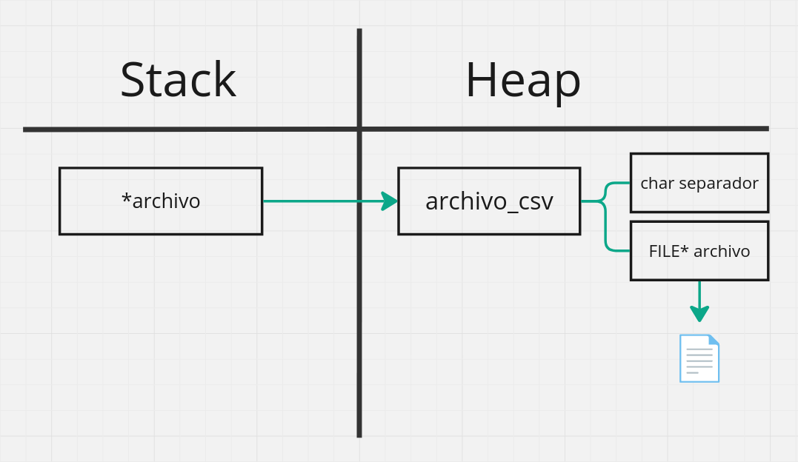

<div align="right">

</div>

# TP1

## Alumno: Sofia Belen Rivas - 112216 - srivas@fi.uba.ar

- Para compilar:

```bash
gcc -std=c99 -Wall -Wconversion -Wtype-limits -pedantic -Werror -O2 -g src/*.c tp1.c -o tp1
```

- Para ejecutar y seleccionar archivo y separador dentro:

```bash
./tp1
```

- Ejecutar pasando el archivo como parámetro:

```bash
./tp1.c archivo.csv
```

- Para ejecutar con valgrind y seleccionar manualmente archivo y separador:
```bash
valgrind --leak-check=full --track-origins=yes --show-reachable=yes --error-exitcode=2 --show-leak-kinds=all --trace-children=yes ./tp1
```
- Para ejecutar con valgrind pasando el archivo como parámetro:
```bash
valgrind --leak-check=full --track-origins=yes --show-reachable=yes --error-exitcode=2 --show-leak-kinds=all --trace-children=yes ./tp1 archivo.csv
```
---

##  Funcionamiento

#### Condiciones para una buena visualización de la interfaz
- La terminal debe estar en **pantalla completa** para evitar desfases en la visualización del contenido impreso.

- Recomendación: Ejecutar el programa sin pasar parámetros (archivo) para seleccionarlo dentro de la aplicación siguiendo las instrucciones proporcionadas. Esto garantiza que se vea todo el flujo de impresiones de manera completa. (Si se decide pasar el archivo como parámetro, la funcionalidad será la misma, pero algunas impresiones podrían no mostrarse.)

---

El presente trabajo práctico implementa una estructura pokedex cuyo objetivo es almacenar y mostrar ordenadamente por pantalla los datos de los pokemones que son pasados al programa mediante una estructura que contiene un archivo en formato 'csv' y su respectivo separador de columnas.

**Ver diagramas de los structs [acá](#respuestas-a-las-preguntas-teóricas).**

Se trabaja con memoria dinámica constantemente, tanto para inicializar los structs como para obrar dentro de estos; asimismo, también se realoca dicha memoria a la hora de agregar pokemones de forma ordenada con sus respectivos datos.

---

#### Selección del archivo

Al utilizar el programa, el usuario tiene dos opciones para cargar el archivo CSV:

1. **Pasar el archivo como parámetro**: Si se elige esta opción, se debe pasar el archivo con su respectiva extensión como argumento en la terminal. El programa asumirá que el separador de columnas es el valor predeterminado (';').
2. **Elegir el archivo manualmente y especificar el separador**: En esta opción, el programa se ejecuta sin pasar ningún argumento por parámetro. Una vez iniciado, el usuario deberá ingresar el nombre del archivo sin su extensión y especificar el separador utilizado en el archivo, se solicita que no se escriba la extensión ya que se asumirá que es un archivo de tipo 'csv' y se le agregará esta extensión a su nombre utilizando `strcat`

---

#### Carga de información

Como se mencionó anteriormente, se trabaja la información con una estructura que contiene un archivo de tipo 'csv' y su separador de columnas; se facilita la lectura del mismo y parseo de sus valores mediante la función `leer_linea_csv`, donde se verifica la validez tanto de los datos del archivo como de las funciones de parseo y posteriormente se procede a trabajar de la siguiente forma:


Esta función se encarga de informar si se ha tenido éxito al aplicar determinadas funciones a los campos que componen una línea del archivo CSV. Las funciones aplicadas deben devolver un valor booleano que indique si se ejecutaron correctamente. La función `leer_linea_csv` incrementará el valor de retorno en una unidad cada vez que una función se aplique con éxito, devolviendo finalmente la cantidad de columnas en las que no se han producido fallos.

**En la implementación final se la llama con las siguientes funciones de parseo:**

`bool leer_int`


`bool crear_string_nuevo`

Crea una nueva cadena de caracteres a partir de la cadena de entrada `str`, siempre y cuando `str` tenga una longitud menor que `MAX_NOMBRE_POKEMON`. La cadena se copia a un buffer estático llamado nuevo, y la dirección de este buffer se almacena en el puntero ctx. La función devuelve true si la operación es exitosa y false si la longitud de str es demasiado grande.

`bool leer_caracter`


---

#### Agregando pokemones

Una vez que los datos han sido parseados correctamente, se procede a asignarlos a un pokemon, que luego se almacena en la estructura pokedex. Estos datos se insertan de forma ordenada para evitar un ordenamiento posterior en la función que itera sobre ellos (aunque, igualmente, se verifica que los pokemon estén ordenados). A continuación, se detalla cómo se agrega un pokemon:

1. **Realocación de memoria**: La memoria destinada al array de pokemones se expande utilizando `realloc`.
2. **Validación de memoria**: Después de cada realocación, se verifica que la operación haya sido exitosa mediante la función `realloc_exitoso`, previniendo errores de memoria que podrían causar leaks.
3. **Inserción ordenada**: El nuevo pokemon se inserta en su posición "correcta" dentro del array, manteniendo el orden alfabético. Para esto, se utiliza una búsqueda de la posición adecuada mediante la función `encontrar_pos_insertar` y luego se desplazan los pokemones hacia la derecha para una correcta inserción.
4. **Duplicación de datos**: El campo *nombre* del struct pokemon se duplica en memoria con la función `duplicar_nombre` para asegurar que los datos originales no sean modificados.

En este proceso, se utiliza la función `leer_linea_csv`, que en este caso se encarga de leer una línea del archivo CSV y asignar los valores correspondientes a las variables temporales. La variable `leidos` guarda la cantidad de columnas leídas correctamente en cada iteración. Cuando `leidos` es igual a `COLUMNAS_POKEDEX`, significa que se han leído todas las columnas correctamente, y por lo tanto, los datos pueden ser asignados a un nuevo pokemon.

---

#### Recorrido e iteración de los pokemones
Una vez que los pokemones han sido agregados y almacenados en la pokedex, se itera sobre ellos para mostrar la información almacenada. El recorrido se realiza de forma ordenada debido al proceso de inserción ordenada explicado anteriormente, garantizando que los pokemones se impriman en orden alfabético sin necesidad de una reordenación adicional.

La función encargada del recorrido de la pokedex permite acceder a los pokemones y posteriormente imprimirlos al pasarle una funcion del tipo `imprimir_pokemon`. De esta forma, se muestran todos sus datos, como su nombre, tipo, fuerza, destreza, y resistencia.

El proceso de iteración se desarrolla de la siguiente manera:

1. **Inicialización del recorrido**: Se comienza desde la primera posición del array de pokemones.
2. **Acceso a los datos**: Para cada pokemon, se accede a la información almacenada en su struct correspondiente y se muestra al usuario.
3. **Avance secuencial**: El puntero de la pokedex avanza uno por uno a través del array, recorriendo todos los pokemones hasta completar el listado.

---

#### Destrucción de la pokedex y liberación de memoria
Una vez que el programa ha finalizado su ejecución y ya no es necesario mantener la información de los pokemones, se libera toda la memoria que fue asignada dinámicamente. Para ello, se utiliza la función `pokedex_destruir`

El proceso de destrucción se lleva a cabo de la siguiente forma:

1. **Liberación de los nombres duplicados**: Para cada pokemon en el array, se libera la memoria asignada a su nombre, que fue duplicada al momento de su inserción.
2. **Liberación de la estructura pokedex**: Después de liberar los nombres, se libera el array de pokemones y finalmente el struct pokedex que contiene la referencia a dicho array.

---

## Respuestas a las preguntas teóricas

**Diagrama del struct archivo_csv**

<p align="center">

</p>

**Diagrama de la pokedex**

<p align="center">

</p>

### 2. Complejidad de las funciones de la cátedra

#### Funciones de pokedex.c

- **`struct pokedex *pokedex_crear()`**  
  **Complejidad:** `O(1)`  
  **Descripción:** Crea una nueva `pokedex`. La operación es constante y no depende del número de pokemones, ya que solo se inicializa una estructura vacía.

- **`bool pokedex_agregar_pokemon(struct pokedex *pokedex, struct pokemon pokemon)`**  
  **Complejidad:** `O(n)`  
  **Descripción:** Agrega un nuevo pokemon a la `pokedex`. La complejidad es `O(n)` debido a el uso de las siguientes operaciones:
  - `desplazar_pokemones`: Necesario para realizar una inserción ordenada a la pokedex, facilitando despues el orden en la función iterar.
  - `realloc`: Redimensiona el array interno para acomodar el nuevo pokemon, lo que puede llegar a involucrar la copia de todos los elementos.

- **`size_t pokedex_cantidad_pokemones(struct pokedex *pokedex)`**  
  **Complejidad:** `O(1)`  
  **Descripción:** La función verifica un puntero y accede a un miembro de la estructura, ambas operaciones son de tiempo constante e independientes de la cantidad de pokemones.

- **`const struct pokemon *pokedex_buscar_pokemon(struct pokedex *pokedex, const char *nombre)`**  
  **Complejidad:** `O(n)`  
  **Descripción:** La complejidad está dada por la búsqueda lineal, siendo n la cantidad de pokemones recorridos.

- **`size_t pokedex_iterar_pokemones(struct pokedex *pokedex, bool (*funcion)(struct pokemon *, void *), void *ctx)`**  
  **Complejidad:** `O(n^2)`  
  **Descripción:** La iteración en sí es `O(n)`, pero si se requiere ordenar los pokemones o realizar operaciones complejas, la complejidad puede aumentar a `O(n^2)`.

- **`void pokedex_destruir(struct pokedex *pokedex)`**  
  **Complejidad:** `O(n)`  
  **Descripción:** La complejidad es `O(n)` debido a la iteración sobre todos los pokemones para liberar la memoria dedicada a sus nombres.

#### Funciones de csv.c

- **`struct archivo_csv *abrir_archivo_csv(const char *nombre_archivo, char separador)`**  
  **Complejidad:** `O(1)`  
  **Descripción:** Abre un archivo CSV y configura el separador de columnas. La función realiza operaciones de tiempo constante, como abrir el archivo y setear parámetros iniciales.

- **`size_t leer_linea_csv(struct archivo_csv *archivo, size_t columnas, bool (*funciones[])(const char *, void *), void *ctx[])`**  
  **Complejidad:** `O(n*m)`
  **Descripción:** La complejidad se debe a:
  - `n`: Longitud de la línea a procesar.
  - `m`: Número de columnas.  
  Las operaciones tenidas en cuenta fueron:
  - `buscar_posicion_separador`: Ya que busca el separador en cada columna, tiene una complejidad de `O(n)` por columna.
  - `procesar_separador` y `procesar_linea`: Procesa datos entre separadores, también `O(n)` por columna.
  - Iteración sobre columnas: `O(m)`.

- **`void cerrar_archivo_csv(struct archivo_csv *archivo)`**  
  **Complejidad:** `O(1)`  
  **Descripción:** La operación es de tiempo constante, ya que se realiza una única operación de cierre.
