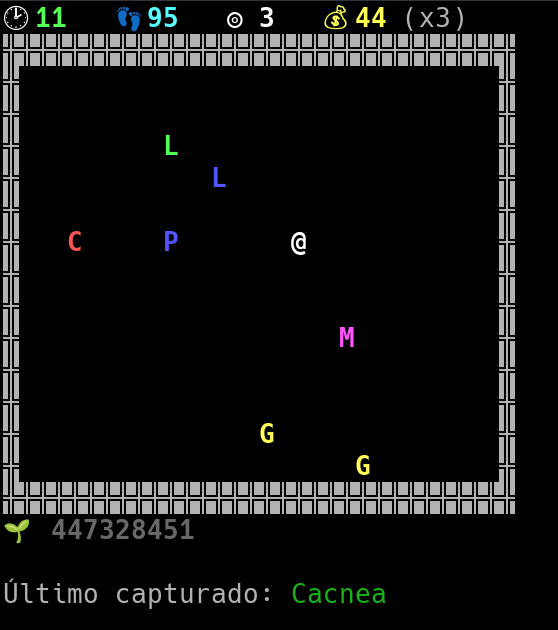

# TP2

Se pide implementar un juego aplicando todo lo aprendido durante la materia. Para ello el alumno debe primero analizar el problema a resolver, definir los TDAs necesarios para el mismo e implementarlos.

## Restricciones

  - No está permitido utilizar vectores/matrices en general. La única excepción permitida es si se necesita utilizar una matriz como almacenamiento auxiliar para dibujar el tablero.
  - Se pueden incluir mas opciones en el menú principal pero se pide que las 4 opciones pedidas (P, J, S, Q) estén presentes y funcionen ya sea con entrada minúscula como mayúscula (tanto 'q' como 'Q' deberían salir de la aplicación).
  - No está permitido modificar ninguno de los TDAs implementados hasta el momento.
  - Cada TDA creado debe tener sus pruebas

## Descripción del juego
   - Primero se muestra un menú principal con las opciones descriptas en la siguiente sección
   - Mediante el menú se puede iniciar el juego o salir de la aplicación
   - El juego consiste en un tablero de 32x15
   - Al iniciar el juego, se coloca al jugador en el primer casillero
   - Al iniciar el juego se generan 7 pokemon al azar de los disponibles en el pokedex (pueden ser repetidos) y se colocan en posiciones al azar en el tablero (pueden superponerse).
   - El jugador puede moverse utilizando los cursores.
   - Cada vez que el jugador se mueve un casillero, los pokemon se mueven también un casillero en la dirección que corresponda según su patron de movimiento.
   - Cada pokemon tiene un patron de movimiento que puede consistir en las siguientes posibilidades:
     - N: Movimiento hacia arriba
     - S: Movimiento hacia abajo
     - E: Movimiento a la derecha
     - O: Movimiento a la izquierda
     - J: Mismo movimiento que el jugador
     - I: Movimiento del jugador invertido
     - R: Movimiento al azar en una de las 4 direcciones
   - Por ejemplo un patron de movimiento "NRS" significa que el pokemon se mueve hacia arriba, luego hace un movimiento al azar, luego hacia abajo y el próximo movimiento vuelve a repetir desde el principio.
   - Si el jugador no se mueve, el pokemon no se mueve.
   - Si el jugador intenta moverse y se choca contra una pared, también cuenta como movimiento.
   - Cada pokemon tiene asociado un puntaje (que se le suma al usuario al capturar dicho pokemon)
   - El puntaje por capturar un pokemon se multiplica por el multiplicador actual del usuario
     - El multiplicador comienza en 1 y se incrementa al atrapar un pokemon cuya inicial o color coincidan con el último pokemon atrapado
     - Si el multiplicado no aumenta, se resetea a 1
   - Un pokemon es capturado si ocupa el mismo casillero que el jugador.
   - Cuando un pokemon es capturado, se crea un nuevo pokemon al azar y se lo agrega al tablero.
   - El juego tiene un tiempo máximo de duración de 60 segundos.
   - Se debe mostrar por pantalla todos los datos relevantes para ayudar al jugador (puntos, multiplicador, ultimo pokemon atrapado, etc).
   - Al finalizar el tiempo (o al presionar la tecla 'q') el juego finaliza.
   - Al finalizar el juego se deben mostrar por pantalla los siguientes datos:
     - El puntaje alcanzado por el jugador
     - El multiplicador máximo alcanzado
     - El combo mas largo realizado (sucesión de pokemones que incrementan el multiplicador)

## Menú principal

Si bien se permiten otras opciones (por ejemplo seleccionar dificultad, cargar otro archivo, seleccionar distintos tipos de tableros, etc), es obligatorio implementar las siguientes opciones que deben ser activadas con los caracteres indicados:

  - P: Muestra el pokedex cargado. Se deben mostrar los pokemon por orden alfabético
  - J: Jugar. Inicia el juego.
  - S: Jugar con semilla. Inicia el juego pero pidiendo un número para utilizar como semilla.
  - Q: Salir. Sale del juego.

## Desarrollo teórico
El informe debe incluir lo siguiente:
  - Explicación de los TDA creados para el TP
    - Cada TDA debe tener una definición que explique qué hace y para qué se utiliza. Se debe incluir una explicación de qué datos y operaciones importantes corresponden al TDA y cuáles son las responsabilidades del mismo.
  - Explicación de los TDAs reutilizados (de los implementados anteriormente en la materia) y para qué fueron utilizados.
